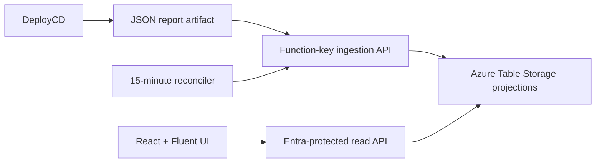

# DeploymentStatus

DeploymentStatus is the authoritative, event-driven view of DeployCD deployments. DeployCD writes a versioned JSON report, a GitHub-hosted job submits it to the Function API, and authenticated Adaptive or customer users read authorization-scoped projections in the React dashboard.



The former static dashboard, sample initialization endpoints, and GitHub polling services have been removed. Existing legacy Azure tables are intentionally untouched and are not read by this application.

## Components

- `DeploymentAPI`: .NET 10 isolated Azure Functions API.
- `frontend`: Vite, React, TypeScript, Fluent UI, MSAL, TanStack Query, Vitest, and Playwright.
- `infra`: production Bicep and repeatable Entra application/group-role setup.
- `DeploymentAPI.Tests`: unit and Azurite-backed projection tests.

## Local development

Requirements: .NET 10 SDK, Azure Functions Core Tools, Node.js 24, and Azurite.

1. Copy `DeploymentAPI/local.settings.template.json` to `DeploymentAPI/local.settings.json`.
2. Start Azurite.
3. In `DeploymentAPI`, run `func start`.
4. In `frontend`, copy `.env.example` to `.env.local`, set `VITE_AUTH_DISABLED=true`, then run `npm ci` and `npm run dev`.

Development authentication headers are accepted only when `Authorization__AllowDevelopmentHeaders=true`. Production Bicep explicitly disables them.

## Verification

```powershell
dotnet test .\DeploymentStatus.slnx --configuration Release
Set-Location .\frontend
npm ci
npm run lint
npm test
npm run typecheck
npm run build
npm run test:e2e
```

Set `AZURITE_CONNECTION_STRING=UseDevelopmentStorage=true` while running `dotnet test` to enable the storage projection integration test.

## Production setup

1. Populate `infra/customer-access.json`, then run `infra/Setup-Entra.ps1` once without a Static Web App URL to create the API and SPA registrations. Record the emitted client IDs.
2. Deploy `infra/main.bicep` with the production resource group, Entra tenant ID, and API client ID.
3. Run `infra/Setup-Entra.ps1` again with `-StaticWebAppUrl` set to the Bicep output so the production PKCE redirect and group role assignments are idempotently applied.
4. Run `infra/Set-DeploymentReporterKey.ps1` to create the function-specific ingestion key and optionally write it to the DeployCD repository secret.
5. Configure DeploymentStatus repository environments/variables used by `deploy-production.yml`, including `AZURE_RESOURCE_GROUP`.
6. Configure DeployCD repository variable `DEPLOYMENT_STATUS_API_URL` and secret `DEPLOYMENT_STATUS_API_KEY`.
7. Deploy, verify the Function App and dashboard, and dispatch the `retaildemo` dry run as the first report.

Read endpoints require a delegated `api://<api-client-id>/Deployment.Read` token and one or more app roles. `DeploymentStatus.Adaptive.All` can read all data and internal diagnostics; `DeploymentStatus.Customer.<customerId>` is customer-safe and supports role unions. The ingestion endpoint alone is excluded from Easy Auth and remains protected by its dedicated Functions key.

## API

The versioned contract is in `DeploymentAPI/openapi.json`:

- `POST /api/v1/deployment-events`
- `GET /api/v1/me`
- `GET /api/v1/customers`
- `GET /api/v1/customers/{customerId}`
- `GET /api/v1/deployments`
- `GET /api/v1/deployments/{eventId}`

A deterministic event ID has the form `repositoryKey:runId:runAttempt:customerId:mode`, where non-URL-safe repository separators such as `/` become `~`. Replays return HTTP 200 with `duplicate: true`; new events return HTTP 201.
